<!-- eğer eklenen içerik yeni bir başlık içeriyorsa, başlıklar tablosuna tanımlanmalı-->

# Çok Güzel Bir Orman
kullanıcının cevaplarına göre çıktı veren deneysel kişilik testi uygulaması 
[orman.muaz712.com](http://orman.muaz712.com)

<table>
  <tr>
    <td><b>başlıklar</b></td>
  </tr>
  <tr>
    <td>
      <ul>
        <li>
          <a href="https://github.com/muaz742/cok-guzel-bir-orman#kullan%C4%B1m">
            Kullanım
          </a>
        </li>
        <li>
          <a href="https://github.com/muaz742/cok-guzel-bir-orman/blob/master/README.md#proje-rehberi">
            Proje rehberi
          </a>
        </li>
        <li>
          <a href="https://github.com/muaz742/cok-guzel-bir-orman#yap%C4%B1-hakk%C4%B1nda">
            Yapı hakkında
          </a>
        </li>
        <li>          
          <a href="https://github.com/muaz742/cok-guzel-bir-orman#%C3%A7al%C4%B1%C5%9Fma-prensibi">
            Çalışma prensibi
          </a>
        </li>
        <li>          
          <a href="https://github.com/muaz742/cok-guzel-bir-orman#katk%C4%B1lar">
            Katkılar
          </a>
        </li>
      </ul>
    </td>
  </tr>
</table>

## Kullanım
- [Orman](http://orman.muaz712.com)'a gir,
- Soruları cevapla,
- Sonuçları gör,
- Dilersen sonuçlarına ait linki paylaş.

## Proje Rehberi
Bu projeye GitHub aracılığıyla katkı sağlayabilirsin. 
*["Git nedir?"](https://www.youtube.com/watch?v=uncrCoLiq-g&list=PLHN6JcK509bOrevTCFrSMeAfBtuib4Gpg)*, *["Nasıl kullanılır?"](https://rogerdudler.github.io/git-guide/index.tr.html)*, *["Git mantığı nasıl çalışır?"](https://github.com/gelis-tr-io/makaleler/blob/master/git/git-mantigi/git-mantigi.md)*

- Fikir ve Önerileri [**Issues**](https://github.com/muaz742/cok-guzel-bir-orman/issues) sayfasından *New Issue* aksiyonuyla paylaşabilirsin.
- *"Anlamam ben gitten mitten"* diyorsan buyur buradan e-posta atabilirsin; [bilgi@muaz712.com](mailto:bilgi@muaz712.com)
- *"E-posta işi zor bana daha kolay bir yol lazım"* diyenler, yorumlarda buluşalım. *(parola: 'mutluymuş')* --> [**Buraya Tıkla!**](https://www.youtube.com/watch?v=i4fNpcG3CDM)

## Yapı Hakkında
Yapı, ekranlardan oluşmaktadır.

"seçim, geçiş, sonuç" olmak üzere 3 tip ekran vardır.

Seçim ekranı, kullanıcının kararlarını seçimler ile ifade ettiği ekranlardır. 
Geçiş ekranı, kullanıcının seçim veya sonuç görüntüleme işlemi yapmadığı ara ekranlardır. 
Sonuç ekranı, kullanıcının seçimlerine göre şekil alan sonuçların görüntülendiği ekranlardır.

|ekran|işlev|
|---|---|
|seçim|veri girdisi alma|
|geçiş|kullanım deneyimi iyileştirme|
|sonuç|rapor çıktısı verme|

Ekranlar, elementlerden oluşmaktadır. 

"başlık, yazı, buton" olmak üzere 3 tip element vardır.

Başlık, yazı biçimindedir. Görüntüleme elementidir. Ekranın üst kısmında bulunur. Her ekranda en fazla 1 başlık bulunabilir. Kullanıcıya yazılı mesaj iletme işlevini sağlar. 
Yazı, yazı biçimindedir. Görüntüleme elementidir. Ekranın orta kısmında bulunur. Her ekranda en fazla 1 başlık bulunabilir. Kullanıcıya yazılı mesaj iletme işlevini sağlar. 
Butonlar, buton biçimindedir. Etkileşim elementidir. Ekranın alt kısmında bulunur. Her ekranda en fazla 10 buton bulunabilir. Kullanıcıdan etki alma işlevini sağlar.

|element|biçim|tip|konum|kullanım limiti|işlev|
|---|---|---|---|---|---|
|başlık|yazı|görüntüleme|üst|1|mesaj verme|
|yazı|yazı|görüntüleme|orta|1|mesaj verme|
|buton|buton|etkileşim|alt|10|mesaj alma|

## Çalışma prensibi
Yapı, kullanıcı seçimleri<!-- ve HTML talepleri-->ne göre tepki verir.

Olaylar, istemci ve sunucuda bulunan iki kontrol birimi tarafından yönetilir. 
Bu birimler, HTTP üzerinden JSON dili kullanarak aralarında iletişim kurar.

 
İşlem aşamaları;
- kullanıcı tarafından ekran üzerinde buton seçimi yapılır.
- İstemci kontrol birimi, kullanıcının seçimini JSON formatına dönüştürür. 
Sunucu kontrol birimine gönderir.
- Sunucu kontrol birimi, gelen talebi yorumlar. 
Uygulanacak aksiyona karar verir. 
Aksiyon dönütünü JSON formatına dönüştürür. 
İstemci kontrol birimine gönderir.
- Aksiyon dönütü alan istemci kontrol birimi, aksiyon tipine göre işlem başlatır. 
Aksiyon verilerini işlemde kullanır.

# Katkılar
Projeye katkıda bulunanları burada ifşa ediyorum.

|Kişi|Katkı|
|---|---|
|kişi adı|kişi katkısı|
|tugay|orman için sonuç yazıları üretti|
