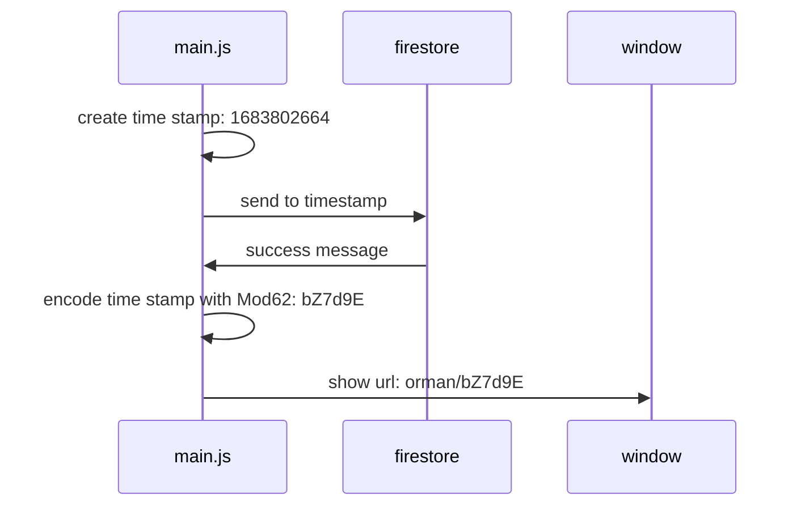
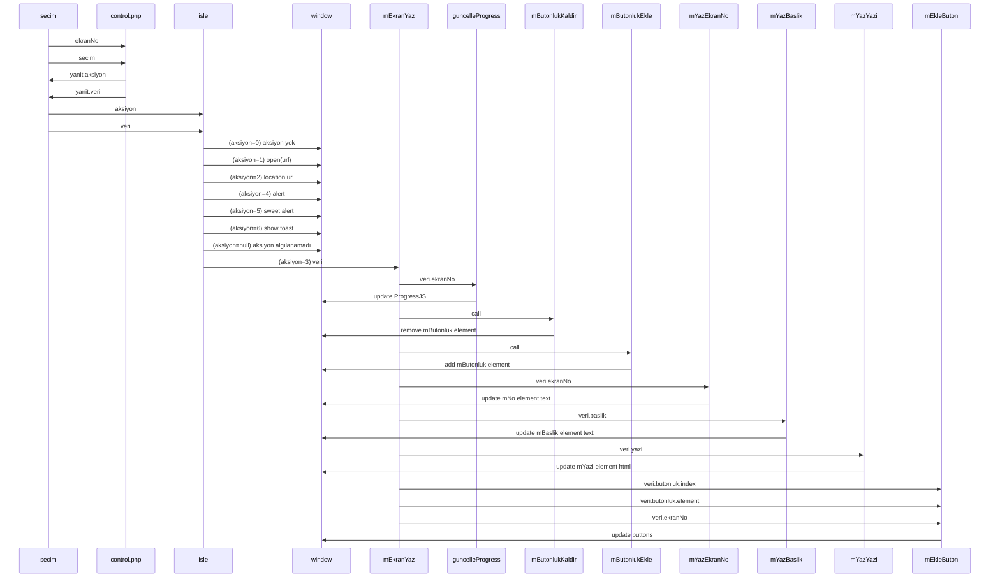
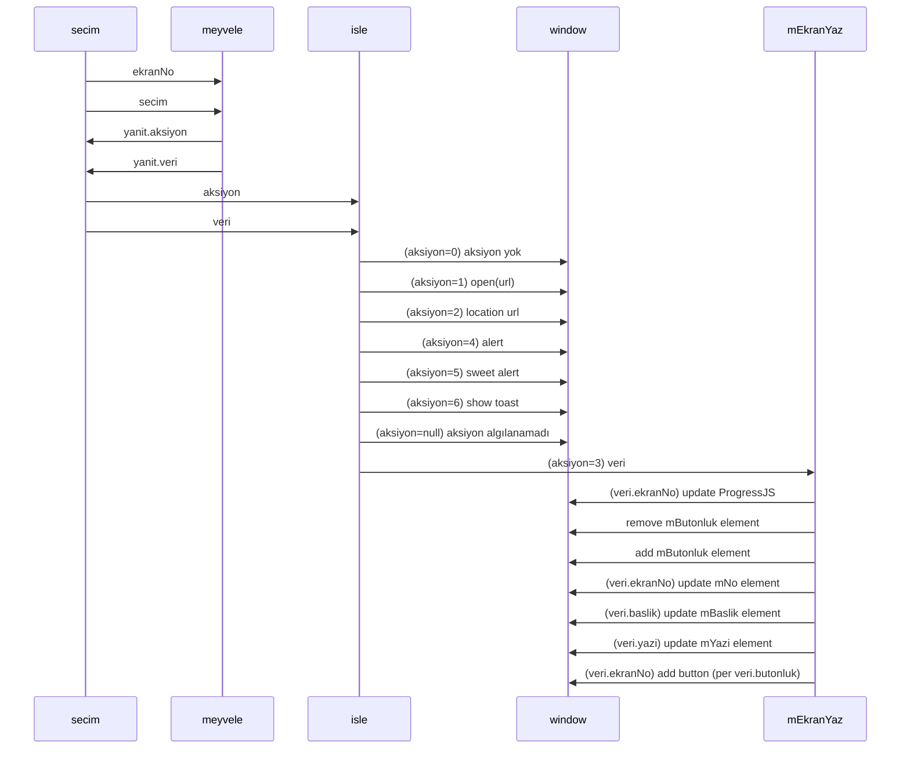
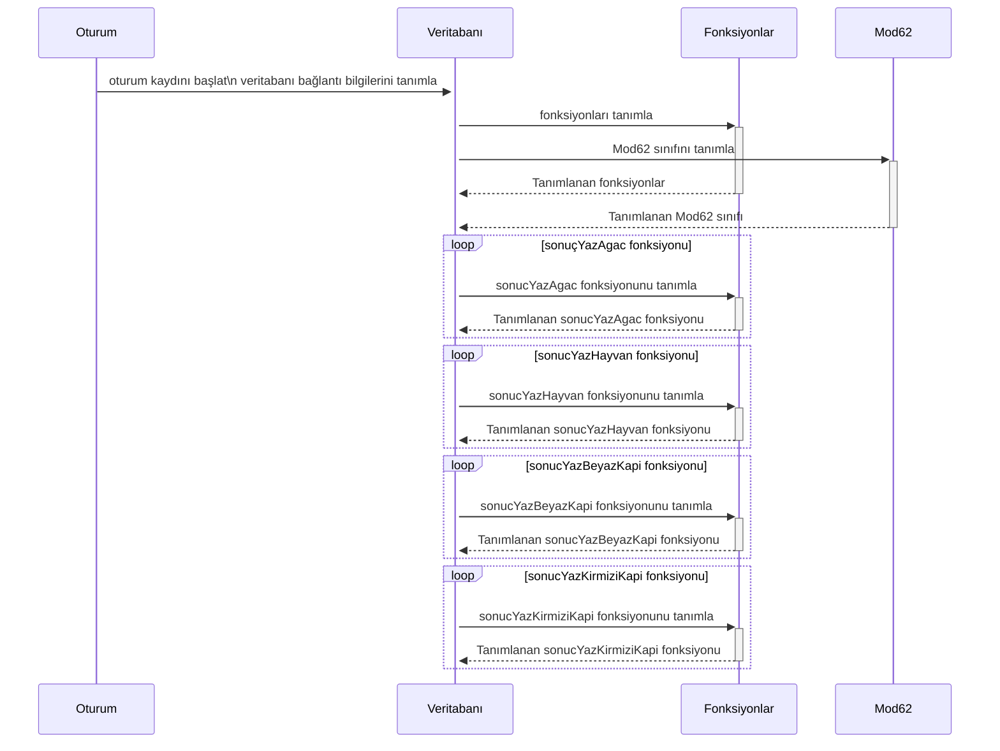

# Send Choice to Firestore Exapmle

```javascript
let secimler = {
    0: 0,
    1: 0,
    2: 1,
    3: 0,
    4: 2,
    5: 0,
    6: 1,
    7: 0,
    8: 0,
    9: 1,
    10: 0,
    11: 0,
    12: 1,
    13: 0,
    14: 1,
    15: 2,
    16: 0,
    17: 0,
    18: 0,
    19: 0,
    20: 1,
    30: 0,
};
let timestamp = String(new Date().getTime());
// Add a new document in collection "secimler"
await setDoc(doc(db, "secimler", timestamp), secimler).then(() => {
    console.log("Document successfully written!");
});
```

# Create URL then save choice to Firestore



# Use Case: User click choice 0.1.0

04.05.2023 19:36:50



# Use Case: User click choice 0.2.0

09.05.2023 23:24:39 



# Load Script File

01.05.2023 09:50:53

